# 🔄 AIRC Chatbot - Sơ đồ Luồng Hệ thống (Mermaid)

> 📌 **Hướng dẫn xem:** File này chứa các sơ đồ Mermaid. Để xem đẹp nhất, hãy mở bằng:
>
> - VS Code với extension "Markdown Preview Mermaid Support"
> - GitHub/GitLab (tự động render)
> - Mermaid Live Editor: https://mermaid.live

---

## 📑 Mục lục

1. [Kiến trúc Tổng thể](#1-kiến-trúc-tổng-thể)
2. [Luồng Đăng nhập (Login)](#2-luồng-đăng-nhập-login)
3. [Luồng Xác thực Token (Core Service)](#3-luồng-xác-thực-token-core-service)
4. [Luồng Chat RAG](#4-luồng-chat-rag)
5. [Luồng Upload File](#5-luồng-upload-file)
6. [Luồng Xử lý File (Background Worker)](#6-luồng-xử-lý-file-background-worker)
7. [Luồng Tạo Chatbot](#7-luồng-tạo-chatbot)
8. [Quan hệ Database](#8-quan-hệ-database)
9. [Kiến trúc Triển khai (GKE)](#9-kiến-trúc-triển-khai-gke)

---

## 1. Kiến trúc Tổng thể

### 📝 Giải thích:

Hệ thống có 3 service chính chạy độc lập:

- **UI Service (Next.js - Port 3000)**: Giao diện web, dùng 2 Axios clients riêng biệt
- **Auth Service (FastAPI - Port 8001)**: Xử lý đăng nhập, JWT, RBAC
- **Core Service (FastAPI - Port 8000)**: Xử lý RAG, chat, datasets, files
- **Worker (RQ)**: Xử lý background jobs (file ingestion)

**Quan trọng**: Core Service KHÔNG có database riêng cho users - khi cần xác thực, nó gọi Auth Service qua HTTP.

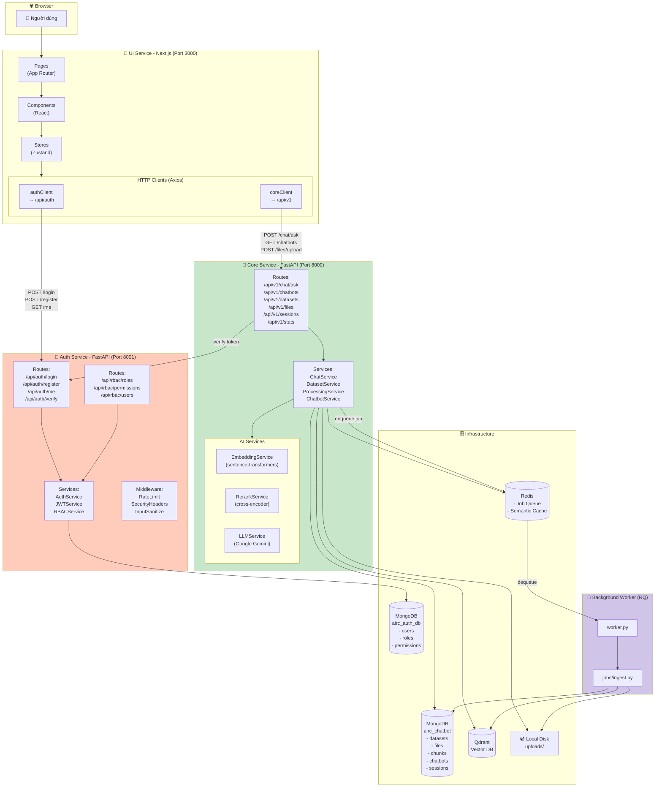

---

## 2. Luồng Đăng nhập (Login)

### 📝 Giải thích:

1. User nhập email/password trên LoginForm
2. UI gọi `authClient.post('/login')` → Auth Service `/api/auth/login`
3. Auth Service kiểm tra email trong MongoDB `users` collection
4. Nếu đúng, tạo JWT token chứa `{user_id, email, role}`
5. UI lưu token vào localStorage và Zustand store
6. Từ đó, mọi request đều gửi token trong header `Authorization: Bearer xxx`

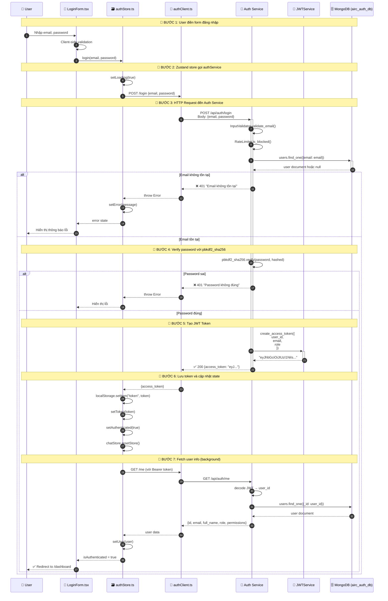

---

## 3. Luồng Xác thực Token (Core Service)

### 📝 Giải thích:

Khi UI gọi Core Service API (chat, datasets, files...), Core Service KHÔNG tự verify JWT. Thay vào đó:

1. Core Service extract token từ header `Authorization: Bearer xxx`
2. Gọi Auth Service endpoint `POST /api/auth/verify` với token
3. Auth Service decode + validate token, trả về user info
4. Core Service dùng user info để check permission và xử lý request

**Tại sao làm vậy?** Vì Core Service không có access đến `JWT_SECRET_KEY` giống Auth Service (trong thực tế có thể share secret, nhưng design hiện tại dùng service-to-service call).

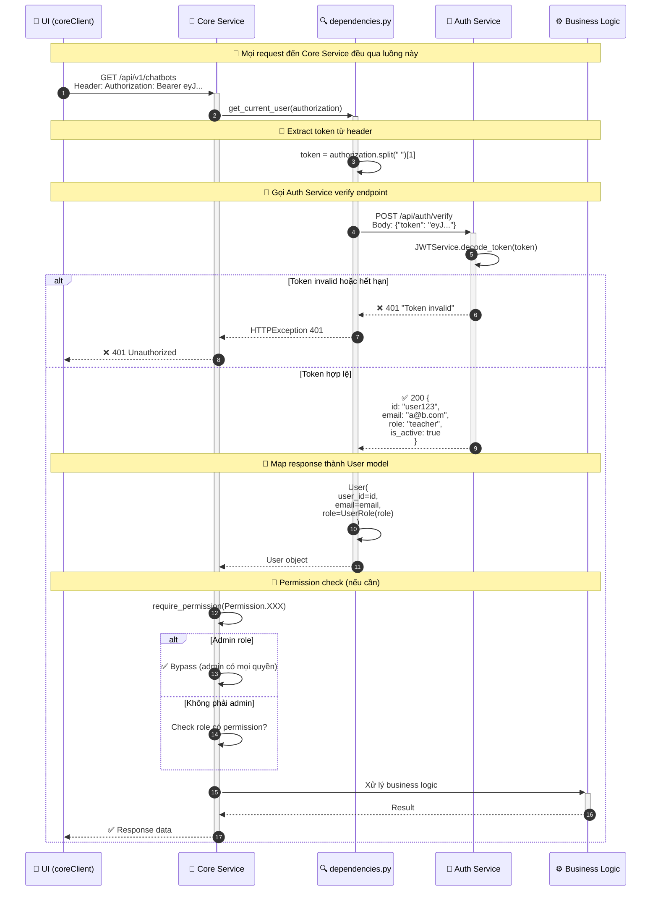

---

## 4. Luồng Chat RAG

### 📝 Giải thích chi tiết từng bước:

1. **User gửi câu hỏi**: UI gọi `POST /api/v1/chat/ask`
2. **Token verification**: Core gọi Auth Service verify token
3. **RBAC Check**: Nếu có `chatbot_id`, kiểm tra user có quyền dùng chatbot không (dựa trên `allowed_roles`)
4. **Context Locking**: Dataset IDs được lock theo chatbot config, user không thể inject datasets khác
5. **Semantic Cache**: Kiểm tra câu hỏi tương tự đã trả lời chưa (Redis)
6. **Embedding**: Dùng `sentence-transformers` convert question → vector 768 chiều
7. **Vector Search**: Tìm top-k chunks tương tự trong Qdrant
8. **Rerank**: Dùng `cross-encoder` sắp xếp lại theo độ liên quan thực sự
9. **LLM Generation**: Xây prompt với context + history, gọi Gemini API
10. **Cache + Save**: Lưu vào cache và session history

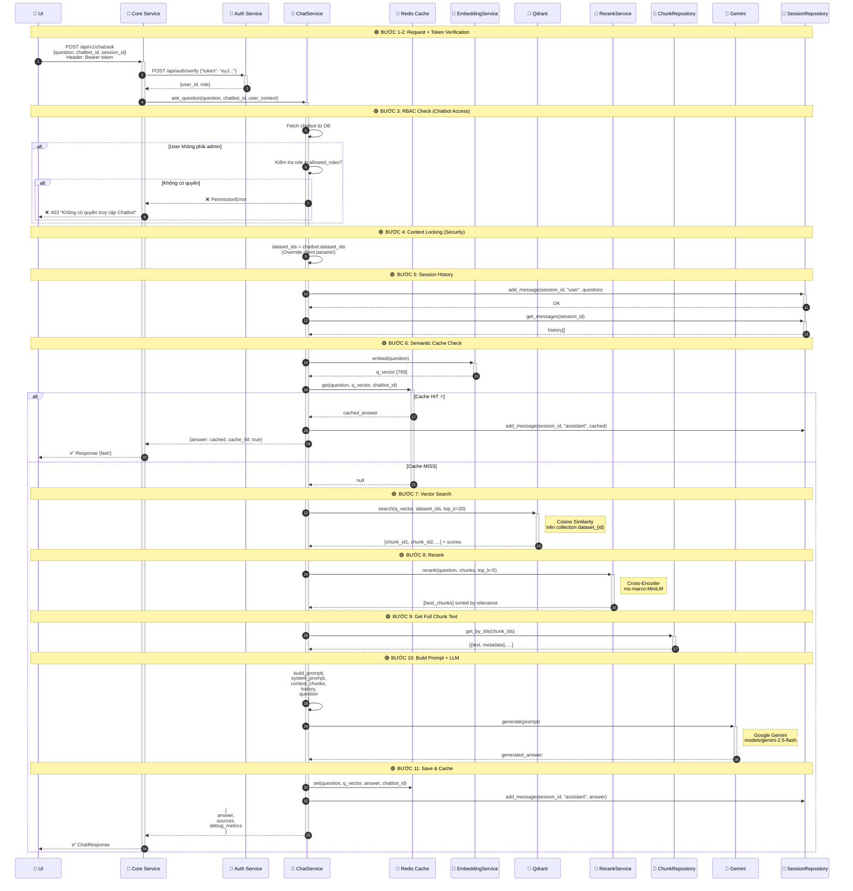

---

## 5. Luồng Upload File

### 📝 Giải thích:

Upload file là **synchronous** - file được lưu ngay và trả về response. Processing là **asynchronous** - chạy background.

1. UI gọi `POST /api/v1/files/upload` với file binary (multipart/form-data)
2. Core verify token qua Auth Service
3. Check permission: chỉ admin/teacher được upload
4. Lưu file vào disk: `uploads/{user_id}/{filename}`
5. Tạo record trong MongoDB `files` collection
6. Trả về file info ngay lập tức (status: READY)

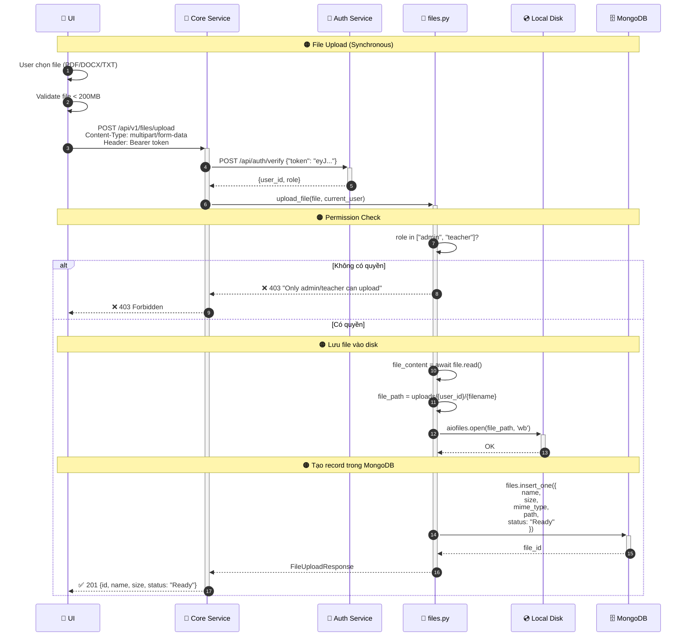

---

## 6. Luồng Xử lý File (Background Worker)

### 📝 Giải thích:

Sau khi upload, user thêm file vào dataset. Lúc này mới trigger background processing:

1. UI gọi `POST /api/v1/datasets/{id}/files` để thêm file vào dataset
2. Core tạo record `dataset_files` với status `PENDING`
3. Core đẩy job vào Redis queue `ingest`
4. Worker (RQ) pick job và chạy `process_dataset_file_job()`
5. Processing: Extract text → Chunking → Embedding → Index vào Qdrant
6. Update status thành `DONE`

**Lưu ý quan trọng**: Worker sử dụng **RQ (Redis Queue)**, KHÔNG phải ARQ.

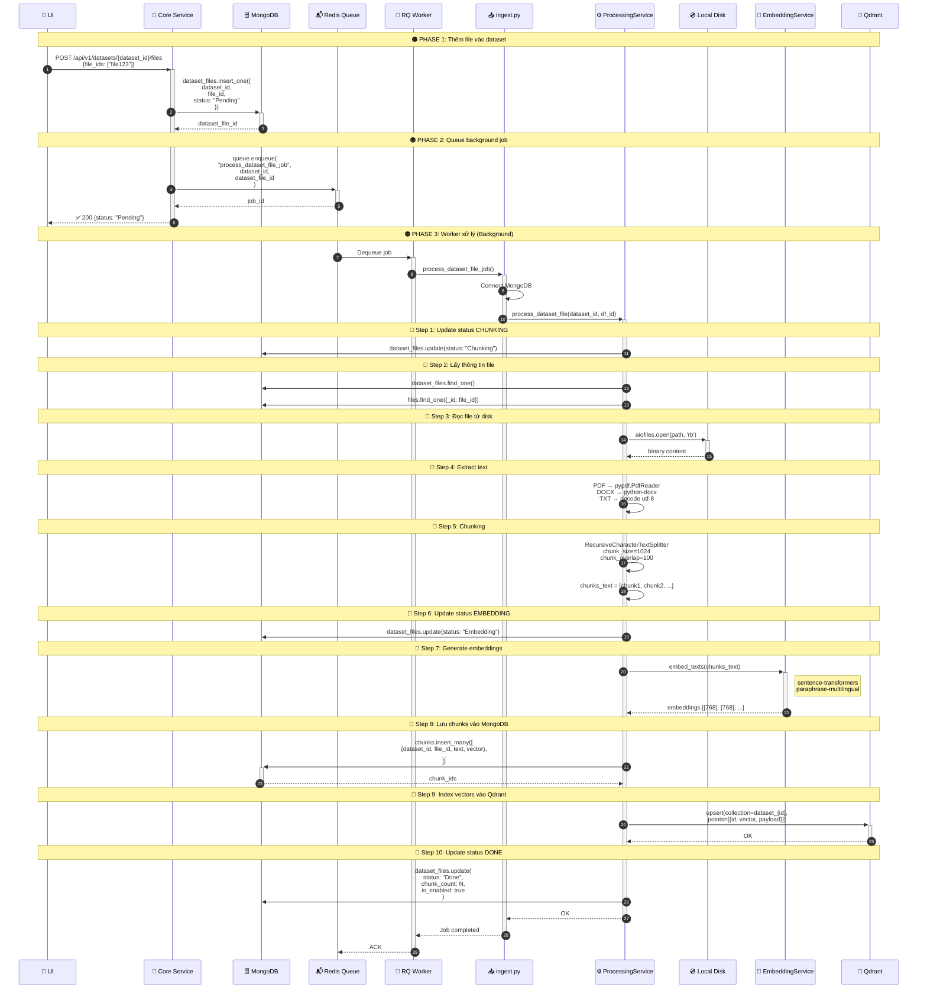

---

## 7. Luồng Tạo Chatbot

### 📝 Giải thích:

Chatbot là cầu nối giữa users và datasets:

- **Admin** tạo chatbot, chọn datasets để dùng
- **allowed_roles**: Roles nào được dùng chatbot (admin luôn có quyền)
- Khi chat, chatbot config quyết định datasets nào được search

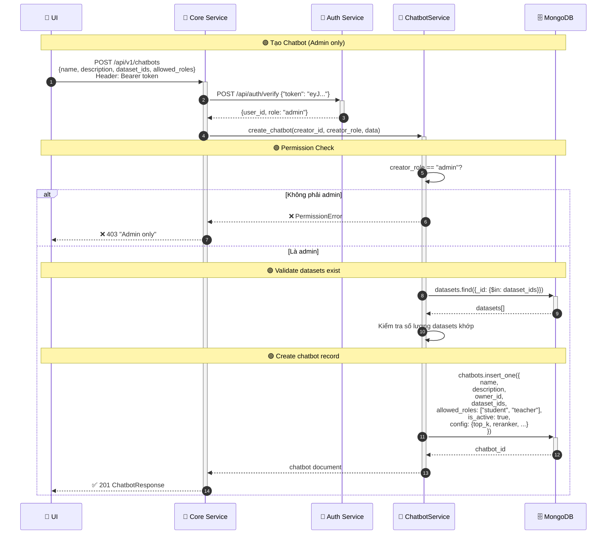

### Luồng Student truy cập Chatbot

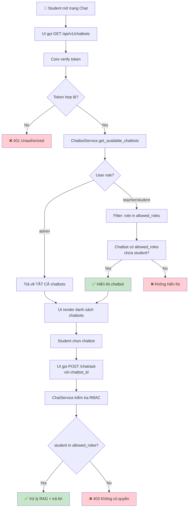

---

## 8. Quan hệ Database

### 📝 Giải thích:

**2 databases MongoDB riêng biệt:**

- `airc_auth_db`: Quản lý bởi Auth Service (users, roles, permissions)
- `airc_chatbot`: Quản lý bởi Core Service (datasets, files, chunks, chatbots, sessions)

**Qdrant**: Mỗi dataset có 1 collection riêng `dataset_{id}` chứa vectors của chunks

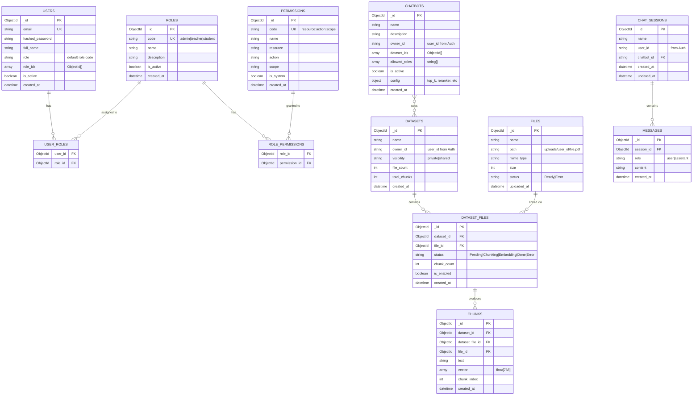

### Qdrant Collections

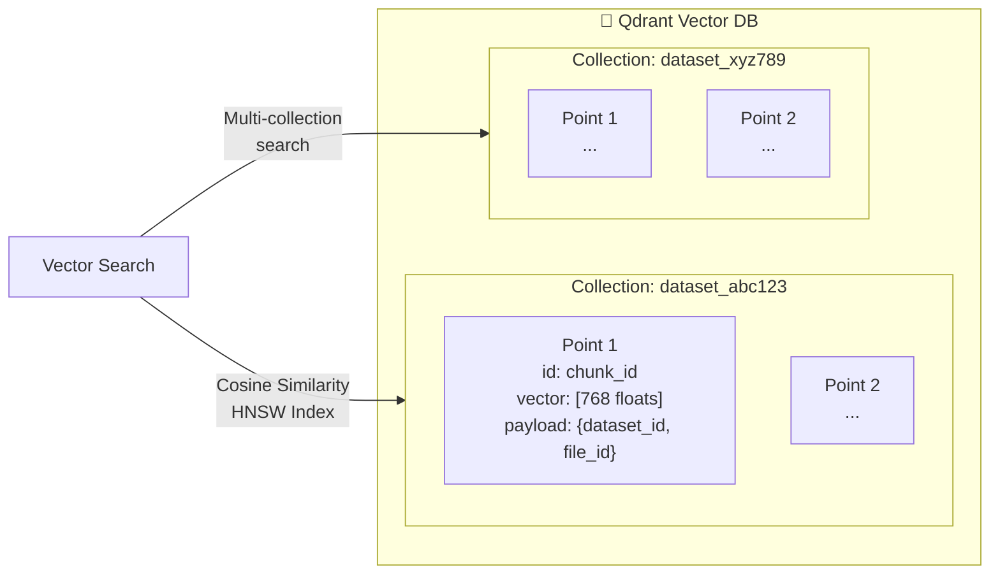

---

## 9. Kiến trúc Triển khai (GKE)

### 📝 Giải thích:

- **Cloudflare Tunnel**: Kết nối domain public với cluster (không cần expose IP)
- **Ingress**: Nginx ingress định tuyến theo path
- **Deployments**: Stateless apps (có thể scale)
- **StatefulSets**: Databases với Persistent Volume Claims

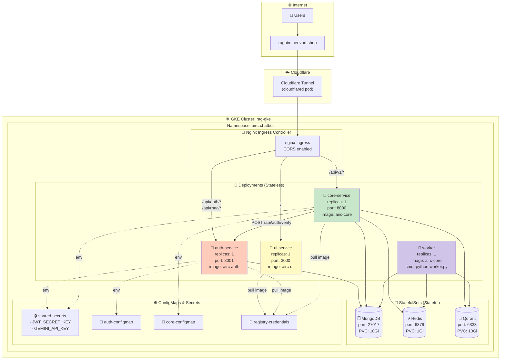

### Ingress Routing Rules

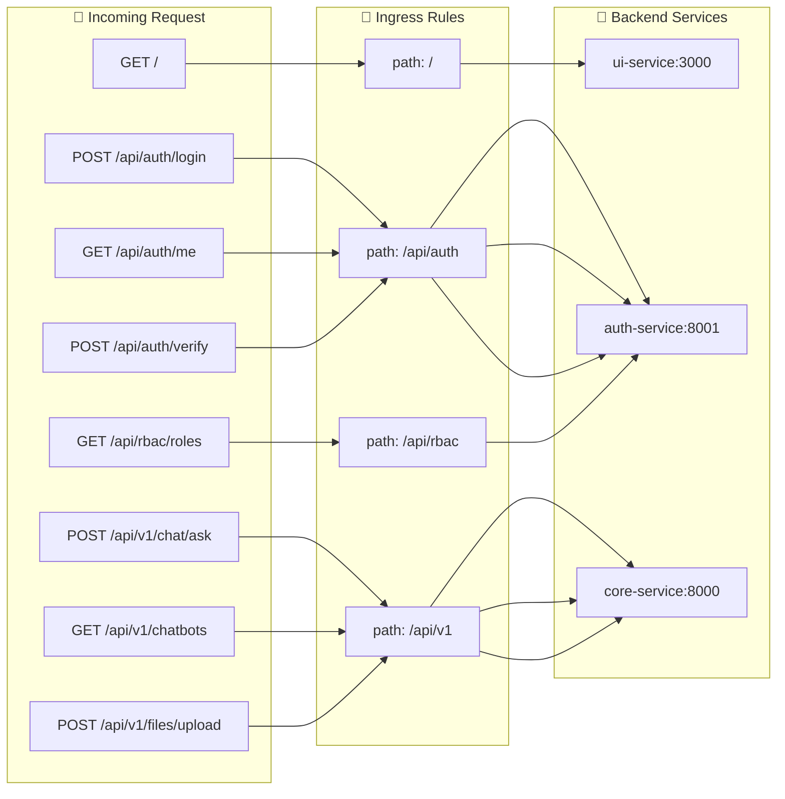

---

## 📊 Tổng hợp API Endpoints

### Auth Service (Port 8001)

| Method | Endpoint                | Mô tả                       | Auth     |
| ------ | ----------------------- | --------------------------- | -------- |
| POST   | `/api/auth/register`    | Đăng ký user mới            | ❌       |
| POST   | `/api/auth/login`       | Đăng nhập                   | ❌       |
| GET    | `/api/auth/me`          | Lấy thông tin user hiện tại | ✅       |
| POST   | `/api/auth/verify`      | Verify JWT token (internal) | ❌       |
| GET    | `/api/rbac/roles`       | Danh sách roles             | ✅ Admin |
| POST   | `/api/rbac/roles`       | Tạo role mới                | ✅ Admin |
| GET    | `/api/rbac/permissions` | Danh sách permissions       | ✅ Admin |
| GET    | `/api/rbac/users`       | Danh sách users             | ✅ Admin |

### Core Service (Port 8000)

| Method | Endpoint                      | Mô tả                   | Auth             |
| ------ | ----------------------------- | ----------------------- | ---------------- |
| POST   | `/api/v1/chat/ask`            | Gửi câu hỏi RAG         | ✅               |
| GET    | `/api/v1/chatbots`            | Danh sách chatbots      | ✅               |
| POST   | `/api/v1/chatbots`            | Tạo chatbot             | ✅ Admin         |
| GET    | `/api/v1/datasets`            | Danh sách datasets      | ✅               |
| POST   | `/api/v1/datasets`            | Tạo dataset             | ✅ Admin/Teacher |
| POST   | `/api/v1/datasets/{id}/files` | Thêm files vào dataset  | ✅               |
| POST   | `/api/v1/files/upload`        | Upload file             | ✅ Admin/Teacher |
| GET    | `/api/v1/files/{id}/view`     | Xem/Download file       | ✅               |
| GET    | `/api/v1/sessions`            | Danh sách chat sessions | ✅               |
| GET    | `/api/v1/stats/dashboard`     | Thống kê dashboard      | ✅               |

---

**📝 Document Version:** 2.0  
**📅 Last Updated:** February 2025  
**👥 Author:** AIRC Team

> 💡 **Tip:** Sử dụng [Mermaid Live Editor](https://mermaid.live) để chỉnh sửa và xem preview các diagram.
